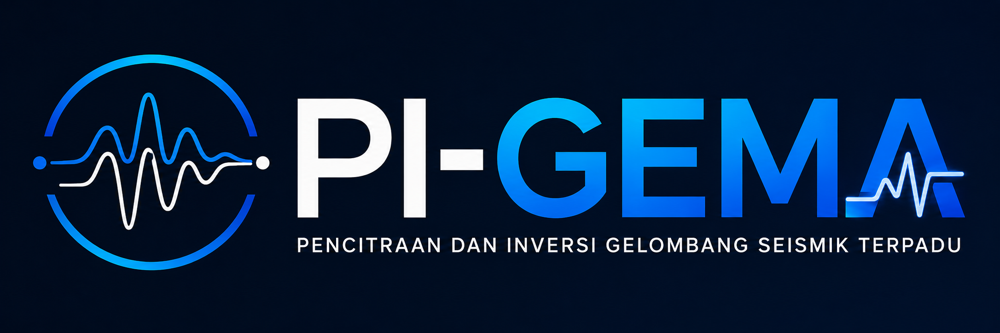

<p align="center">
  
</p>


# PI-GEMA

**Pencitraan Dan Inversi Gelombang Seismik Terpadu**
**(Seismic Imaging and Inversion Software Packages)**

PI-GEMA is a research-oriented scientific software framework for instrument-response calibration, microtremor processing, and seismic inversion.
The repository integrates three major computational modules:
1. **PINNs** - Physics-Informed Neural Networks for instrument transfer-function correction and natural-frequency calibration.
2. **CuHVSR** - CUDA-based Horizontal-to-Vertical Spectral Ratio processing
3. **BFWI** - Bayesian Full Waveform Inversion for subsurface parameter estimation with uncertainty quantification.

The software is organized as a workflow-based scientific engine. Data are processed in a reproducible sequence, beginning with training data, followed by calibration, and ending with hybrid microtremor processing and interpretation.

---

## Repository Structure

The current architecture is organized as follows:

```
PI-GEMA/
├── data/
│   ├── calibrated/
│   ├── microtremor/
│   │   └── sample_001.txt
│   ├── processed/
│   └── training/
│       ├── 1.txt
│       ├── 2.txt
│       └── ...
├── examples/
├── models/
├── outputs/
├── pigema/
│   ├── bfwi/
│   │   └── BFWI.py
│   ├── cuhvsr/
│   │   └── CuHVSR.py
│   ├── pinns/
│   │   └── PINN_NFC_CUDA.py
│   └── workflows/
│       ├── Execute_PINNs.py
│       ├── Transfer_Training.py
│       └── Test_Hybrid_Processing.py
├── tests/
├── config.py
├── environment.yml
├── pyproject.toml
├── requirements.txt
└── setup.py
```

### Directory Roles

- **data/training/**
  Input data used for PINNs training

- **data/microtremor/**
  Raw microtremor observations, including smartphone-acquired three-component records

- **data/calibrated/**
  Calibrated time-series produced by the transfer-function correction workflow.

- **data/processed/**
  Intermediate or finalized processed datasets, depending on the selected workflow

- **models/**
  Save models, transfer functions, checkpoints, and learned parameters.

- **outputs/**
  Plots, reports, exported curves, figures, and other final results.

- **pigema/**
  Core source code, separated into the three scientific engines and the workflow layer.

- **tests/**
  Unit and integration tests only. Operational datasets should remain in `data\`

- **config.py**
  Central path configuration for project-root discovery and directory management

---

## Scientific Workflow

PI-GEMA is designed to execute the following pipeline:

1. **PINNs Training** : 
   Training data are used to estimate the instrument transfer function and/or calibrate the natural-frequency correction model.

2. **Transfer Calibration** : 
   Raw microtremor observations are corrected using the learned transfer function and written into the calibrated data directory.

3. **Hybrid Processing** : 
   Calibrated data are passed to the CuHVSR and BFWI workflows for spectral analysis, inversion, visualization, and final interpretation.

In practical terms:

```
data/training
      ↓
Execute_PINNs.py
      ↓
models/transfer_functions_streaming.npz
      ↓
Transfer_Training.py
      ↓
data/calibrated
      ↓
Test_Hybrid_Processing.py
      ↓
outputs/
```

---

## Main Modules

### PINNs

`pigema/pinns/PINN_NFC_CUDA.py`

The PINNs module implements a physics-informed calibration workflow for natural-frequency correction and instrument-response estimation. Its main components include:

- ambient-noise statistical reference construction;
- transfer-function modeling in the frequency domain;
- physics-informed loss terms;
- smoothness regularization;
- CUDA-accelerated training where available

This module is intended for smartphone-based or non-standard acquisition systems that require calibration against a physically constrained response model.


### CuHVSR

`pigema/cuhvsr/CuHVSR.py`

The CuHVSR module provides the infrastructure for 3-component microtremor processing, including:

- time-series preprocessing;
- trimming, detrending, and gap handling;
- 3C synchronization;
- window selection and rejection;
- spectral estimation;
- diffuse field
- HVSR computation;
- plotting and statistical summaries.

This module is designed to operate consistently on both CPU and GPU backends, depending on the available environment.


### BFWI

`pigema/bfwi/BFWI.py`

The BFWI module provides a probabilistic inversion framework for subsurface parameter estimation. Its major elements include:

- 1D shear-horizontal forward propagation;
- transfer-matrix or impedance-based response modeling;
- likelihood evaluation;
- maximum a posteriori (MAP) optimization;
- local posterior sampling;
- uncertainty quantification.

This module is used to estimate seismic parameters such as shear-wave velocity and density, together with credible intervals.

---

## Requirements

PI-GEMA is designed for Python 3.10 or newer.

Core scientific packages typically include:

- NumPy
- SciPy
- Matplotlib
- Pandas
- ObsPy
- h5py
- PyYAML
- SymPy
- NetworkX
- Shapely
- segyio

GPU-enabled workflows additionally require:

- CuPy with a CUDA-compatible build
- PyTorch and, when needed, torchaudio / torchvision
- A working NVIDIA driver and CUDA runtime
- Optional MPI support for distributed workflows

The repository includes both `requirements.txt` and `environment.yml` to support reproducible installation.

---


## Installation

PI-GEMA supports installation from GitHub source code, Clone the Repository, or a reproducible Conda environment

### Install from GitHub

Install the latest development version directly from GitHub:

```
pip install git+https://github.com/johanesgedo/PI-GEMA.git
```

### Clone the Repository

Clone the repository and install in editable mode:

```
git clone https://github.com/johanesgedo/PI-GEMA.git
cd PI-GEMA
pip install -e .
```

### Conda Environment

Create the recommended environment from the provided configuration:

```
conda env create -f environment.yml
conda activate pigema_env
```

### Dependency Installation Only

if you prefer to install dependencies manually:

```
pip install -r requirements.txt
```

### GPU Requirements

GPU-accelerated workflows require:
- NVIDIA GPU with CUDA support
- compatible NVIDIA driver
- CuPy build matching the installed CUDA version
- PyTorch build compatible with the installed CUDA version

Example:
```
pip install cupy-cuda12x
```

Users should ensure that the installed CuPy and PyTorch packages match the CUDA runtime available on their system.

---


## Running the Workflows

The workflow scripts are located in `pigema/workflows/`

### 1. Train PINNs

```bash
python pigema/workflows/Execute_PINNs.py
```

Expected results:

- a learned transfer function in `models/`;
- training checkpoints or serialized model artifacts in `models/`;
- diagnostic figures in `outputs/`.


### 2. Calibrate Microtremor Data

```bash
python pigema/workflows/Transfer_Training.py
```

Expected results:

- calibrated time-series in `data/calibrated/`;
- optional metadata or auxiliary files in `output/` or `models/`, depending on configuration.


### 3. Run Hybrid Processing

```bash
python pigema/workflows/Test_Hybrid_Processing.py
```

Expected results:

- HVSR curves and summaries;
- inversion and calibration outputs;
- plots, reports, and processed results in `outputs/`

---

## Input Data Conventions

The repository is configured for the following data layout:

- `data/training/` contains the training set used by `Execute_PINNs.py`.
- `data/microtremor/` contains raw records such as `sample_001.txt`.
- `data/calibrated/` contains the calibrated outputs generated by `Transfer_Training.py`
- `data/processed/` is reserved for final or intermediate processed products.

For consistency, use stable file names such as:

```
sample_001.txt
sample_002.txt
...
```

and keep the case identifier synchronized with the file names used by the workflow scripts.

---

## Outputs

The `outputs/` directory is reserved for derived products, such as:

- spectral plots;
- calibration figures;
- HVSR summaries;
- inversion reports;
- training diagnostics;
- Image artifacts produced by the workflows

A recommended internal structure is:

```
outputs/
├── figures/
├── hvsr/
├── reports/
└── logs/
```

---

## Development Notes

- `config.py` centralizes project paths and should be updated when the repository is moved to a new machine or storage location.
- Keep operational data in `data/` and avoid using `tests/` for production inputs.
- Use `__init__.py` files consistently so that `pigema` and its submodules remain importable.
- Prefer package-relative or package-qualified imports over hardcoded absolute paths.

---

## Example Usage

A typical workflow in Python may look like this:

```python
from pigema.pinns.PINN_NFC_CUDA import PINN_Instrument_Model
from pigema.cuhvsr.CuHVSR import HvsrTraditionalProcessingSettings
from pigema.bfwi.BFWI import BayesianFWI
```

Or, at a workflow level:

```python
from pigema.workflows.Execute_PINNs import main as train_pinns
from pigema.workflows.Transfer_Training import main as calibrate
from pigema.workflows.Test_Hybrid_Processing import main as run_hybrid

train_pinns()
calibrate()
run_hybrid()
```

---

## Status

PI-GEMA is a research and prototyping framework intended for scientific development, validation, and publication-oriented geophysical computing.

---

---

## License and Citation

PI-GEMA is distributed under the terms and conditions specified in the `LICENSE` file included in this repository.

An archived release of PI-GEMA is publicly available through Zenodo and can be cited using the following DOI:

**DOI:** [10.XXXX/zenodo.xxxxxxx]
(https://doi.org/10.xxxx/zenodo.xxxxxxx)

If PI-GEMA contributes to published research, scientific reports, or technical documentation, users are encouraged to cite the corresponding Zenodo record in addition to any relevant scientific publications associated with the project.

---

---

## References

PI-GEMA is developed based on the following references:

1. Baena-Rivera, M., Arciniega-Ceballos, A., Sánchez-Sesma, F. J., Rosado-Fuentes, A., & Pardo-Dañino, J. C. (2024). Directional HVSR at the Chalco lakebed zone of the Valley of Mexico: Analysis and interpretation. Journal of Applied Geophysics, 228. https://doi.org/10.1016/j.jappgeo.2024.105452
2. Berti, S., Aleardi, M., & Stucchi, E. (2024). A Bayesian approach to elastic full-waveform inversion: application to two synthetic near surface models. Bulletin of Geophysics and Oceanography, 65(2), 291–308. https://doi.org/10.4430/bgo00442
3. Berti, S., Ravasi, M., Aleardi, M., & Stucchi, E. (2025). Bayesian full waveform inversion of surface waves with annealed stein variational gradient descent. Geophysical Journal International, 241(1), 641–657. https://doi.org/10.1093/gji/ggaf067
4. Cheng, T., Cox, B. R., Vantassel, J. P., & Manuel, L. (2020). A statistical approach to account for azimuthal variability in single-station HVSR measurements. Geophysical Journal International, 223(2), 1040–1053. https://doi.org/10.1093/gji/ggaa342
5. Cheng, T., Hallal, M. M., Vantassel, J. P., & Cox, B. R. (2021). Estimating unbiased statistics for fundamental site frequency using spatially distributed HVSR measurements and Voronoi tessellation. Journal of Geotechnical and Geoenvironmental Engineering, 147(4), 04021068. https://doi.org/10.1061/(ASCE)GT.1943-5606.0002551
6. Cho, I., & Iwata, T. (2019). A Bayesian Approach to Microtremor Array Methods for Estimating Shallow S Wave Velocity Structures: Identifying Structural Singularities. Journal of Geophysical Research: Solid Earth, 124(1), 527–553. https://doi.org/10.1029/2018JB015831\
7. Cox, B. R., Cheng, T., Vantassel, J. P., & Manuel, L. (2021). A statistical representation and frequency-domain window-rejection algorithm for single-station HVSR measurements. Geophysical Journal International, 221(3), 2170–2183. https://doi.org/10.1093/GJI/GGAA119
8. Farazi, A. H., Hossain, M. S., Ito, Y., Piña-Flores, J., Kamal, A. S. M. M., & Rahman, M. Z. (2023). Shear wave velocity estimation in the Bengal Basin, Bangladesh by HVSR analysis: implications for engineering bedrock depth. Journal of Applied Geophysics, 211. https://doi.org/10.1016/j.jappgeo.2023.104967
9. Guo, J., Khurana, G. S., Grande, A. G., del Alamo, J. C., & Contijoch, F. (2025). Computed Tomography (CT)-derived Cardiovascular Flow Estimation Using Physics-Informed Neural Networks Improves with Sinogram-based Training: A Simulation Study. http://arxiv.org/abs/2511.03876
10. Guo, P., Visser, G., & Saygin, E. (2021). Bayesian trans-dimensional full waveform inversion: Synthetic and field data application. Geophysical Journal International, 222(8), 610–627. https://doi.org/10.1093/GJI/GGAA201
11. Kan, L. Y., Chevrot, S., & Monteiller, V. (2023). A consistent multiparameter Bayesian full waveform inversion scheme for imaging heterogeneous isotropic elastic media. Geophysical Journal International, 232(2), 864–883. https://doi.org/10.1093/gji/ggac363
12. Kumar, V. M., Yildiz, A., & Kowalski, J. (2025). Bayesian data selection to quantify the value of data for landslide runout calibration. https://doi.org/10.5194/egusphere-2025-4531
13. Li, Y., Zhang, H., Yan, Z., & Alkhalifah, T. (2025). DiffusionInv: Prior-enhanced Bayesian Full Waveform Inversion using Diffusion models. http://arxiv.org/abs/2505.03138
14. Linde, N., Meles, G., & Marelli, S. (2025). Accelerated Bayesian Full Waveform Inversion with Multifidelity Surrogate Modeling. https://doi.org/10.5194/egusphere-egu25-4226
15. Lontsi, A. M., García-Jerez, A., Molina-Villegas, J. C., Sánchez-Sesma, F. J., Molkenthin, C., Ohrnberger, M., Krüger, F., Wang, R., & Fäh, D. (2019). A generalized theory for full microtremor horizontal-to-vertical [H/V(z, f)] spectral ratio interpretation in offshore and onshore environments. Geophysical Journal International, 218(2), 1276–1297. https://doi.org/10.1093/gji/ggz223
16. Lunedei, E., & Albarello, D. (2010). Theoretical HVSR curves from full wavefield modelling of ambient vibrations in a weakly dissipative layered Earth. Geophysical Journal International, 181(2), 1093–1108. https://doi.org/10.1111/j.1365-246X.2010.04560.x
17. Meles, G. A., Marelli, S., & Linde, N. (2025). Bayesian full waveform inversion with sequential surrogate model refinement. Geophysical Journal International, 243(2). https://doi.org/10.1093/gji/ggaf349
18. Peterson, J. (1993). Observations and modeling of seismic background noise (Open-File Report 93–322). U.S. Geological Survey, Albuquerque, New Mexico. 
19. Pan, D., Miura, H., & Kwan, C. (2024). Transfer learning model for estimating site amplification factors from limited microtremor H/V spectral ratios. Geophysical Journal International, 237(1), 622–635. https://doi.org/10.1093/gji/ggae065
20. Rigo, A., Sokos, E., Lefils, V., & Briole, P. (2021). Seasonal variations in amplitudes and resonance frequencies of the HVSR amplification peaks linked to groundwater. Geophysical Journal International, 226(1), 1–13. https://doi.org/10.1093/gji/ggab086
21. Sánchez-Sesma, F. J., Rodríguez, M., Iturrarán-Viveros, U., Luzón, F., Campillo, M., Margerin, L., García-Jerez, A., Suarez, M., Santoyo, M. A., & Rodríguez-Castellanos, A. (2011). A theory for microtremor H/V spectral ratio: Application for a layered medium. Geophysical Journal International, 186(1), 221–225. https://doi.org/10.1111/j.1365-246X.2011.05064.x
22. Seivane, H., García-Jerez, A., Navarro, M., Molina, L., & Navarro-Martínez, F. (2022). On the use of the microtremor HVSR for tracking velocity changes: a case study in Campo de Dalías basin (SE Spain). Geophysical Journal International, 230(1), 542–564. https://doi.org/10.1093/gji/ggac064
23. Shen, W., Ritzwoller, M. H., Schulte-Pelkum, V., & Lin, F. C. (2013). Joint inversion of surface wave dispersion and receiver functions: A Bayesianmonte-Carlo approach. Geophysical Journal International, 192(2), 807–836. https://doi.org/10.1093/gji/ggs050
24. Şık, F., Teixeira, F. L., & Shanker, B. (2025). Sparse Operator-Adapted Wavelet Decomposition Using Polygonal Elements for Multiscale FEM Problems. http://arxiv.org/abs/2512.16004
25. Taufik, M. H., Huang, X., & Alkhalifah, T. (2025). Latent Representation Learning in Physics-Informed Neural Networks for Full Waveform Inversion. Earth and Space Science, 12(9). https://doi.org/10.1029/2024EA004107
26. Trynda, J., Maczuga, P., Oliver-Serra, A., García-Castillo, L. E., Schaefer, R., & Woźniak, M. (2025). An h-adaptive collocation method for Physics-Informed Neural Networks. Journal of Computational Science, 91. https://doi.org/10.1016/j.jocs.2025.102684
27. Vantassel, J. P. (2020). hvsrpy: A Python package for horizontal-to-vertical spectral ratio (HVSR) analysis (Version latest) [Software]. Zenodo. https://doi.org/10.5281/zenodo.3666956
28. Welch, P. D. (1967). The use of fast Fourier transform for the estimation of power spectra: A method based on time averaging over short, modified periodograms. IEEE Transactions on Audio and Electroacoustics, 15(2), 70–73. 
29. Welter, A., & Nguyen, N. C. (2025). Preconditioning Techniques for Hybridizable Discontinuous Galerkin Discretizations on GPU Architectures. http://arxiv.org/abs/2512.13619
30. Yokota, K., Harakawa, R., Baba, M., & Iwahashi, M. (2025). Physics-Informed Neural Networks for Speech Production. http://arxiv.org/abs/2511.00428
31. Zaenudin, A., Farduwin, A., Boy Darmawan, G. I., & Karyanto. (2024). Shear wave velocity model using HVSR inversion beneath Bandar Lampung City. Earthquake Science, 37(4), 337–351. https://doi.org/10.1016/j.eqs.2024.04.004
32. Zhang, X., & Curtis, A. (2024). Bayesian variational time-lapse full waveform inversion. Geophysical Journal International, 237(3), 1624–1638. https://doi.org/10.1093/gji/ggae129
33. Zhang, X., Lomas, A., Zhou, M., Zheng, Y., & Curtis, A. (2023). 3-D Bayesian variational full waveform inversion. Geophysical Journal International, 234(1), 546–561. https://doi.org/10.1093/gji/ggad057
34. Zhao, X., & Curtis, A. (2024). Physically Structured Variational Inference for Bayesian Full Waveform Inversion. Journal of Geophysical Research: Solid Earth, 129(11). https://doi.org/10.1029/2024JB029557
35. Zhao, X., & Curtis, A. (2025). Efficient Bayesian Full Waveform Inversion and Analysis of Prior Hypotheses in 3D. http://arxiv.org/abs/2409.09746
36. Zhu, H., Li, S., Fomel, S., Stadler, G., & Ghattas, O. (2016). A Bayesian approach to estimate uncertainty for full-waveform inversion using a priori information from depth migration. Geophysics, 81(5), R307–R323. https://doi.org/10.1190/GEO2015-0641.1
37. Zhang, Z., Xiong, X., Zhang, S., Zhao, Y., & Yang, X. (2025). Physics-Informed Neural Networks and Neural Operators for Parametric PDEs: A Human-AI Collaborative Analysis. http://arxiv.org/abs/2511.04576
38. Zhu, Y., Deng, W., & Bi, R. (2025). A Two-stage Adaptive Lifting PINN Framework for Solving Viscous Approximations to Hyperbolic Conservation Laws. http://arxiv.org/abs/2511.04490


